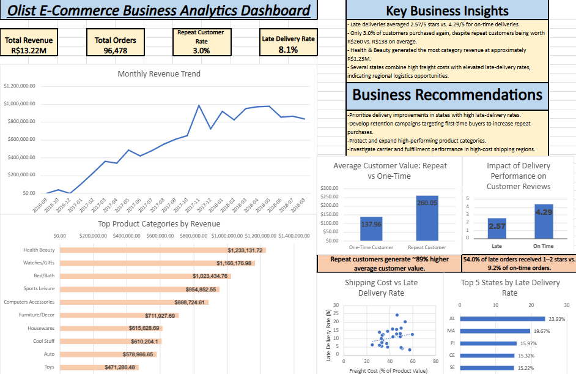

# Olist E-Commerce Business Analytics Project

## Project Overview

This project analyzes Brazilian e-commerce data from Olist to identify business trends, customer behavior, operational challenges, and opportunities for improvement.

I used Google BigQuery and SQL to analyze multiple relational datasets, then built an Excel dashboard to communicate the most important findings and translate the analysis into business recommendations.

**Project scope:** approximately 96,000 delivered orders and R$13.2M in product revenue. Revenue calculations use product value and exclude freight costs.

## Project Workflow

**Olist CSV Data → Google BigQuery → SQL Analysis → Excel Dashboard → Business Recommendations**

## Tools Used

- Google BigQuery
- SQL
- Microsoft Excel
- Data visualization
- Dashboard development
- Business analysis

## Business Questions

This analysis focused on several key questions:

- How has revenue changed over time?
- Which product categories generate the most revenue?
- How valuable are repeat customers compared with one-time customers?
- How do late deliveries affect customer satisfaction?
- Which states have the highest late-delivery rates?
- Is there a relationship between shipping costs and delivery performance?

## Dashboard

## Key Findings

### Customer Retention

Only **3.0% of customers made more than one purchase**.

Repeat customers generated approximately **R$260 in average customer value compared with R$138 for one-time customers**, making repeat customers about **89% more valuable on average**.

### Delivery Performance & Customer Satisfaction

Late deliveries were associated with substantially lower customer satisfaction.

- Late deliveries averaged **2.57 / 5 stars**
- On-time deliveries averaged **4.29 / 5 stars**
- **54.0% of late orders received a 1–2 star review**
- Only **9.2% of on-time orders received a 1–2 star review**

### Product Performance

Health & Beauty generated the highest product revenue at approximately **R$1.23 million**, followed by Watches & Gifts at approximately **R$1.17 million**.

### Regional Delivery Performance

Delivery performance varied significantly by state.

The highest late-delivery rates included:

- AL — **23.93%**
- MA — **19.67%**
- PI — **15.97%**
- CE — **15.32%**
- SE — **15.22%**

### Shipping Efficiency

Some regions experienced both high freight costs and elevated late-delivery rates.

The analysis showed a slight positive relationship between freight cost as a percentage of product value and late-delivery rates. However, the relationship was not strong enough to conclude that higher shipping costs alone explain delivery delays.

## Business Recommendations

1. Prioritize delivery improvements in regions with high late-delivery rates.
2. Develop retention strategies designed to encourage first-time customers to make additional purchases.
3. Protect and expand high-performing product categories such as Health & Beauty.
4. Investigate carrier and fulfillment performance in regions with high shipping costs and poor delivery performance.

## SQL Analysis

The SQL queries used for this project are available in:

`sql/analysis_queries.sql`

The analysis included:

- Multi-table SQL joins
- Common Table Expressions (CTEs)
- Aggregations
- Conditional calculations
- Customer segmentation
- Revenue analysis
- Logistics analysis
- Customer review analysis
- Time-series analysis

## Dataset

This project uses the **Brazilian E-Commerce Public Dataset by Olist**, available through Kaggle.

The dataset contains anonymized information about orders, customers, products, payments, reviews, sellers, and delivery activity.

The raw CSV files are not included in this repository and can be downloaded from the original Kaggle dataset.

## Project Files

- `Olist_Business_Analytics_Project.xlsx` — Excel analysis and interactive dashboard
- `olist_dashboard.png` — Dashboard preview
- `sql/analysis_queries.sql` — SQL queries used for the analysis

## What I Learned

This project strengthened my ability to work with relational data, write SQL queries across multiple tables, investigate business problems, identify meaningful trends, and translate analytical findings into clear business recommendations.
